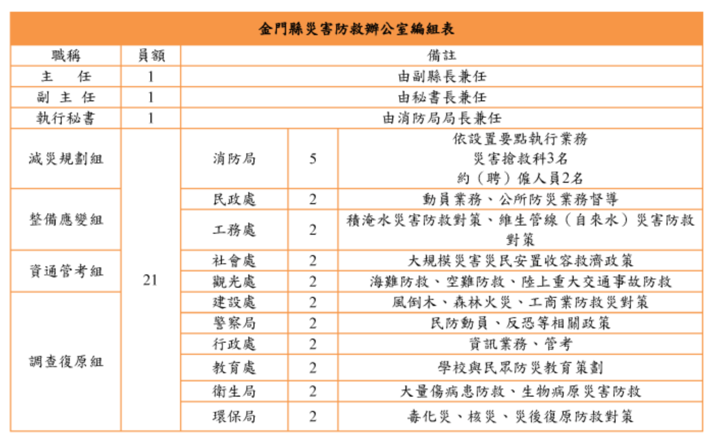

# 第四週上課重點
## 中央災害發生執行單位
| 執行單位 | 事件 |
| -- | -- |
| 內政部 | 火災、風災、爆炸、震災 |
| 經濟部 | 水災、旱災、礦災、公用氣體與油料管線 + 輸電線路災害 |
| 交通部 | 空難、海難、陸上交通事故 |
| 農委會 | 寒害、森林火災、土石流災害 |
| 環保署 | 毒性化學物質災害 |

## 金門災害發生執行單位（期中考必考）
| 事件 | 執行單位 |
| -- | -- |
| 水災 | 工務處（抽水機）  民政處（民眾撤離）  教育處（學生撤離）  金防部（軍隊搜救車）  車船處（一般搜救車）  警察局（警車，強制撤離）  消防局（救護車） |
| 風災 | 消防局 |
| 火災（不包含森林火災）| 消防局 |
| 森林火災 | 林務所、建設處 |
| 災害收容所 | 社會處 |
| 海難 | 觀光處 |
| 溺水 | 岸巡（高潮線往內陸 500 公尺）  海巡（低潮線往外 500 公尺）|
| 土石流 | 農委會、地方建設處 |
| 飛機墜機 | 觀光處 |
| 地震 | 消防局 |
| 豬瘟 | 建設處、動植物防疫所 |
 

## 災防防救體系發展歷程
* 法條演變順序及原因
    * 1964 年 1 月 18 日：發生白河地震
* 防救天然災害及善後處理辦法時期：約 30 年
    * 1994 年 4 月 26 日：發生華航名古屋空難
* 災害防救方案時期：約 6 年
    * 1999 年 9 月 21 日：發生集集大地震
* 災害防救法時期
    * 2009 年：八八風災
* 災害防救法修正

## 災害防救法重點與特徵
* 確立**三層級**（中央 → 直轄市 / 縣市 → 鄉鎮市）與分階段防災的災害防救體系
* **明訂各類災害防救工作的主管機關**
* 各層級設立**災害防救會報**，並設置專責機構（單位）辦理會報決議事項
* 規定**成立**各類**災害應變組織**，亦即**災害應變中心（EOC）**